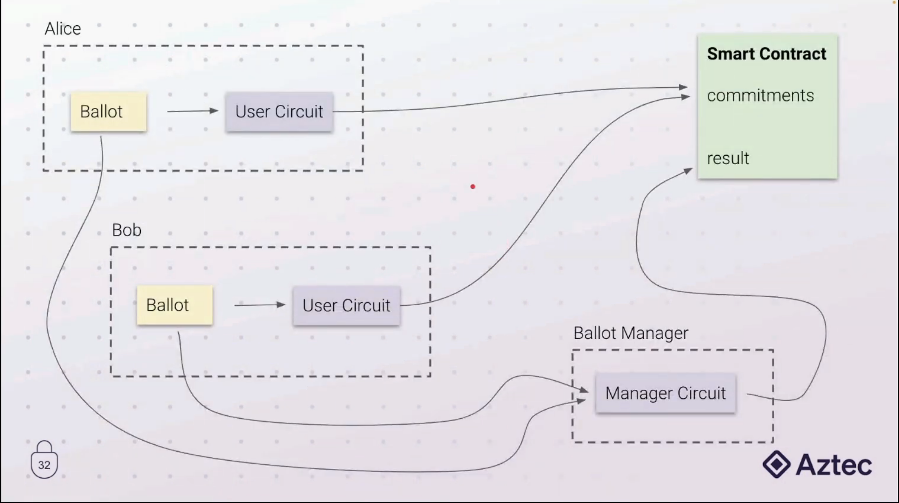

# Quadratic voting using zk proofs



## Installation and Setup

To use the project, you will need to have the following installed on your system:

- [Nargo](https://noir-lang.org/getting_started/nargo/installation.html)
- [Just](https://github.com/casey/just)

## Commands

Build the constraint system
```bash
just check
``` 

Run the tests
```bash
just check
``` 

Generate prove 
```bash
just prove
``` 

Verify prove 
```bash
just prove
``` 

Generate solidity verifier
```bash
just codegen-verifier
```

## ressources:
https://github.com/ggonzalez94/zk-quadratic-voting

https://www.youtube.com/watch?v=5CziMfChveY

https://noir-lang.org/

https://github.com/noir-lang/awesome-noir